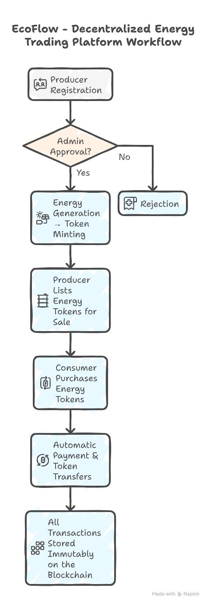

# ⚡ EcoFlow – Decentralized Energy Trading Platform

> A transparent, peer-to-peer marketplace for trading tokenized renewable energy (ERC-20) on Ethereum.

[](https://opensource.org/licenses/MIT)
[](https://soliditylang.org/)
[](https://reactjs.org/)
[]()

---

## 💡 Overview & Mission

EcoFlow is a **decentralized energy trading platform (DApp)** that connects renewable energy producers directly with consumers.

It leverages smart contracts to ensure secure, transparent, and instant settlement for energy transactions. Each unit of real-world renewable energy (kWh) is represented by an **Energy Token (ET)**, enabling a truly peer-to-peer energy market.

---

## 🌟 Core Features

### 🧑‍🏭 Producer Ecosystem
* **Secure Registration:** Producers register via the `ProducerRegistry` contract.
* **Token Minting:** Authorized producers can **Mint Energy Tokens (ET)**, converting physical energy into digital assets.
* **Financial Control:** View balances, pending approvals, sales history, and securely **withdraw earnings**.

### 🛒 Consumer Marketplace
* **Direct Purchase:** Buy energy tokens directly from the `EnergyMarketplace` contract.
* **Transparency:** View account balance, total spending, and comprehensive purchase history.

### 💰 Automated Marketplace Engine
* **Dynamic Pricing:** Supports dynamic pricing mechanisms based on supply and demand logic (implemented via smart contract).
* **Trustless Settlement:** Automated **escrow and payout** system guarantees instant, intermediary-free settlement to producers.
* **Revenue Tracking:** Internal tracking for total tokens sold and marketplace revenue.

### 🛡️ Admin & Governance
* **Verification:** Admins have the power to **Approve or Reject** new producer registration requests, maintaining ecosystem integrity.

---

## 🛠️ Tech Stack & Architecture

| Category | Component | Key Technologies | Description |
| :--- | :--- | :--- | :--- |
| **Smart Contracts** | Core Logic | **Solidity**, Hardhat, **Ignition Modules** | The backend business logic for registration, minting, trading, and settlement. |
| **Blockchain** | Deployment Target | Ethereum Hoodi / Local **Hardhat Chain** | Environment for contract execution and data storage. |
| **Frontend** | User Interface | **React + Vite**, **Tailwind CSS**, React Router | Fast, modern, and responsive user interface for dApp interaction. |
| **Web3 Integration** | Client Libraries | **viem** (readContract, writeContract, getLogs) | Minimalist, robust library for interacting with the EVM and handling wallet connections. |

---
## 🔄 Workflow

<p align="center">
  
</p>

---

## ⚙️ Quick Start: Running the Application

Follow these steps to get EcoFlow running on your local machine.

1. **📂 Clone the Repository:**

    ```bash
    git clone git@github.com:varshavikraman/ENERGY-TRADING-PLATFORM-DAPP.git
    ```
    ```bash
    cd ENERGY-TRADING-PLATFORM-DAPP
    ```

2. **⬇️ Install Dependencies:** 

- You must install dependencies for both the smart contract (Hardhat) and the frontend (React).

* <b>Install Hardhat dependencies (Smart Contracts)</b>

    ```bash
    cd Hardhat
    npm install
    ```

- *If initializing manually:*

    ```bash
    npx hardhat --init
    ```
* <b>Install React dependencies (Frontend)</b>

    ```bash
    cd React
    npm install
    ```

- *If newly creating:*

    ```bash
    npm create vite@latest 
    ```

3. **🚀 Start the Local Blockchain:**  

- Open a new terminal window for the blockchain node.

    ```bash
        npx hardhat node
    ``` 
- *(Keep this terminal running.)*

4. **🔗 Deploy Contracts:**  

- In a separate terminal, deploy the contracts.

* <b>Local Blockchain:</b>

    ```bash
        npx hardhat ignition deploy ./ignition/modules/DeployAll.js --network localhost
    ```

* <b>Hoodi Testnet:</b>

    ```bash
        npx hardhat ignition deploy ./ignition/modules/DeployAll.js --network hoodi
    ```

4. **🌐 Run the Frontend:**

- Navigate to the React directory and start the development server.

    ```bash
        cd React
        npm run dev
    ```
- *The application will now be accessible, usually at `http://localhost:5173`.*

---

## 🎬 Demo & Showcase

Watch a full walkthrough of the registration, minting, listing, and purchasing processes on EcoFlow.

<a href="https://drive.google.com/file/d/1NJv9rfqaCuxtjpqpjVNUVhoCq75js0y2/view?usp=sharing" target="_blank">▶️ [Watch Demo]</a>  


